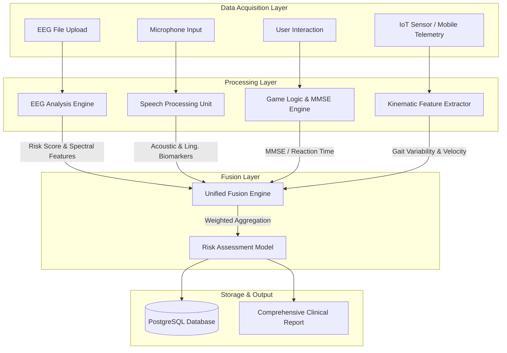
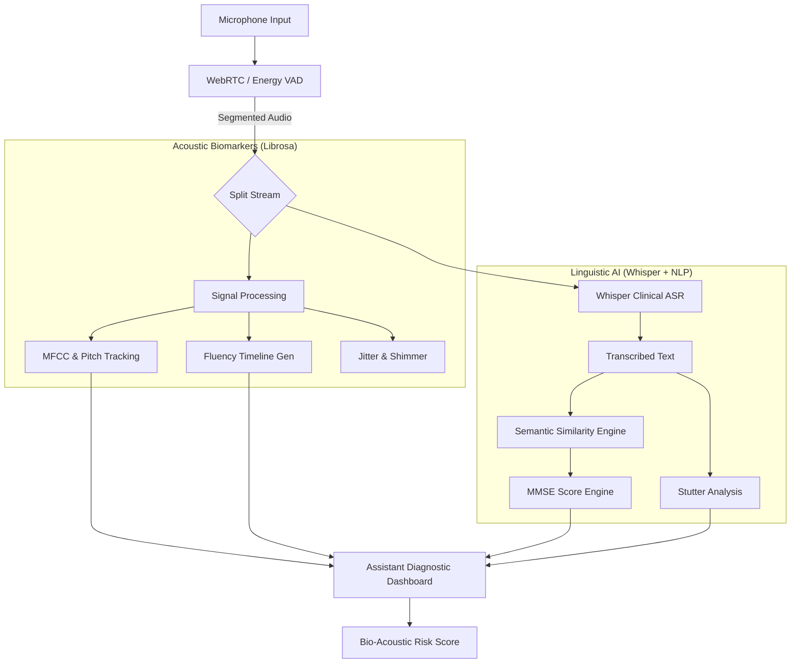

# 🧠 CogniSafe

## AI-Powered Multi-Modal Cognitive Health Assessment Platform

  

> **Revolutionizing early detection of neurodegenerative disorders through the fusion of EEG signal processing, speech biomarkers, and gamified cognitive testing.**

---

## 🚀 Overview

**CogniSafe** is a state-of-the-art diagnostic support tool designed to screen for early signs of cognitive decline (MCI, Alzheimer's, Dementia). Unlike traditional paper-based tests, CogniSafe leverages **multi-modal AI** to analyze four distinct biological and behavioral data streams:

1. **Neurophysiological**: EEG brainwave analysis for spectral slowing.
2. **Biomarker**: Speech acoustic (pitch, jitter, shimmer) and linguistic patterns.
3. **Behavioral**: Gamified cognitive challenges and MMSE digitalization.
4. **Kinematic**: IoT-based Gait analysis tracking spatial-temporal movement patterns.

By synthesizing these diverse data points, CogniSafe provides a holistic, objective, and highly accurate risk assessment score.

---

## 🏗️ System Architecture

### 🌐 Combined System Architecture

This diagram illustrates how the three distinct modalities converge into the Unified Fusion Engine to produce the final cognitive health assessment.



---

## 🧩 Deep-Dive Module Architectures

### 1. 🧠 EEG Analysis Module

The EEG pipeline is designed to detect "spectral slowing," a hallmark of early-stage neurodegeneration. It processes raw multi-channel signals to extract frequency-domain biomarkers.

**Technical Workflow:**

1. **Ingestion**: Accepts `.edf` (European Data Format) or `.csv` files.
2. **Preprocessing**:
    * **Resampling**: Standardizes all inputs to 256 Hz.
    * **Filtering**: Applies a 5th-order Butterworth bandpass filter (0.5 - 50 Hz) to remove DC drift and high-frequency noise.
    * **Notch Filter**: Removes 50/60 Hz power line interference.
3. **Feature Engineering**:
    * Computes **Power Spectral Density (PSD)** using Welch's method (Hamming window, 50% overlap).
    * Calculates **Relative Band Power (RBP)** for 5 bands: Delta (0.5-4Hz), Theta (4-8Hz), Alpha (8-13Hz), Beta (13-30Hz), Gamma (30-45Hz).
    * Derives clinical ratios: **Theta/Beta Ratio (TBR)** and **Delta/Alpha Ratio (DAR)**.
4. **Classification**: A trained Random Forest classifier (100 trees) predicts the probability of cognitive impairment based on the feature vector.

```mermaid
graph TD
    subgraph "1. Preprocessing Pipeline"
        Raw[Raw EEG Data] --> Resample[Resample @ 256Hz]
        Resample --> Bandpass[Bandpass Filter 0.5-50Hz]
        Bandpass --> Notch[Notch Filter 60Hz]
        Notch --> Artifact["Artifact Rejection (ICA)"]
    end

    subgraph "2. Feature Extraction (Frequency Domain)"
        Artifact --> Welch[Welch's Periodogram]
        Welch --> PSD[Power Spectral Density]

        PSD --> |Integration| Bands

        subgraph "Spectral Bands"
            Bands --> Delta["Delta (0.5-4Hz)"]
            Bands --> Theta["Theta (4-8Hz)"]
            Bands --> Alpha["Alpha (8-13Hz)"]
            Bands --> Beta["Beta (13-30Hz)"]
        end

        Delta & Theta & Alpha & Beta --> Ratios[Clinical Ratios]
        Ratios --> TBR["Theta/Beta Ratio"]
        Ratios --> DAR["Delta/Alpha Ratio"]
    end

    subgraph "3. Inference Engine"
        TBR & DAR & Bands --> Vector[Feature Vector (1x18)]
        Vector --> RF[Random Forest Model]
        RF --> Prob[Risk Probability %]
    end
```

### 2. 🗣️ High-Fidelity Speech & MMSE Module

This module utilizes a **clinical-grade dual-stream architecture** to analyze both *how* the user speaks (Acoustic) and *what* they say (Linguistic), integrated with localized MMSE assessment logic.

**Technical Workflow:**

1. **Acoustical Stream**:
    * **Clinical VAD**: Real-time Voice Activity Detection using energy thresholds and Mel-frequency analysis for automatic recording management.
    * **Interactive Fluency**: Generates a millisecond-precision **Fluency Timeline** visualizing speech vs. silence segments using `librosa`.
    * **Acoustic Biomarkers**: Extracts fundamental frequency (F0), **Jitter**, **Shimmer**, and spectral energy variance to identify subtle neuro-motor changes.
2. **Linguistic & MMSE Stream**:
    * **Whisper AI**: Industry-standard transcription with clinical-context prompting to handle hesitant or dysfluent speech.
    * **Semantic Scoring**: Automated MMSE grading using **Levenshtein distance** and **spaCy NLP** to validate orientations (Date, Location) and cognitive responses.
    * **Stutter Detection**: Identifies repeated word patterns and dysfluency markers as early indicators of cognitive load.



### 3. 🚶 IoT Gait & Kinematic Module

Analyzes spatial-temporal gait parameters as a biomarker for neurodegenerative risk, focusing on gait variability and postural stability.

**Technical Workflow:**

1. **Data Ingestion**: Receives 3-axis accelerometer and gyroscope telemetry via high-frequency ESP32 streams or mobile sensor proxies.
2. **Kinematic Feature Extraction**:
    * **Step Regularity**: Analyzes the periodicity of movement peaks to detect gait irregularity.
    * **Velocity & Cadence**: Calculates steps-per-minute and travel speed as key vitality markers.
    * **Balance Metrics**: Measures postural sway and mediolateral stability using raw IMU data.
3. **Risk Mapping**: Correlates kinematic instability with established clinical benchmarks for cognitive impairment.

### 4. 🎮 Cognitive Games Module

The games module is an event-driven system that captures high-resolution behavioral data (millisecond precision) to map performance to specific cognitive domains.

**Technical Workflow:**

1. **Event Loop**: React `requestAnimationFrame` loop captures user inputs with <16ms latency.
2. **Metric Calculation**:
    * **Stroop**: Calculates "Interference Score" (Reaction Time Incongruent - Reaction Time Congruent).
    * **Trail Making**: Tracks "Time to Completion" and "Error Rate" (wrong node connections).
    * **Memory**: Measures "Span" (max items recalled) and "Working Memory Accuracy".
3. **Normalization**: Raw scores are Z-scored against age-matched population norms (simulated) to determine percentiles.

```mermaid
graph TD
    User[User Interaction] -->|Touch/Click| EventListener[Event Listener]

    subgraph "Game Engines"
        EventListener --> Memory[Memory Match Engine]
        EventListener --> Stroop[Stroop Test Engine]
        EventListener --> Trail[Trail Making Engine]
    end

    subgraph "Raw Metric Capture"
        Memory -->|State Change| MemAcc["Accuracy %"]
        Stroop -->|Timestamp Diff| RT["Reaction Time (ms)"]
        Trail -->|Path Validation| Errors[Error Count]
    end

    subgraph "Cognitive Domain Mapping"
        MemAcc --> DomainMem[Memory Domain]
        RT --> DomainAtt[Attention Domain]
        Errors --> DomainExec[Executive Function]

        DomainMem & DomainAtt & DomainExec --> Norm[Z-Score Normalization]
    end

    Norm --> FinalScores[Domain Scores (0-100)]
```

---

## 🧩 Core Modules

### 1. 🧠 EEG Analysis Engine

The EEG module processes raw brainwave data (EDF/CSV formats) to detect spectral abnormalities associated with cognitive decline, such as the "slowing" of background rhythms (increased Theta/Delta, decreased Alpha/Beta).

**Key Capabilities:**

* **Signal Preprocessing**: Artifact removal and bandpass filtering.
* **Feature Extraction**: Calculates Relative Band Power (RBP) for Delta, Theta, Alpha, Beta, and Gamma bands.
* **ML Inference**: Random Forest classifier trained on clinical EEG datasets.

```python
# Snippet: Feature Extraction Logic
def extract_features(data, fs=256):
    # Calculate Power Spectral Density (PSD)
    freqs, psd = welch(data, fs=fs, nperseg=fs*2)

    # Extract Band Powers
    bands = {
        'Delta': (0.5, 4), 'Theta': (4, 8),
        'Alpha': (8, 13), 'Beta': (13, 30)
    }

    features = []
    for band, (low, high) in bands.items():
        # Integrate PSD over the frequency band
        idx_band = np.logical_and(freqs >= low, freqs <= high)
        band_power = simps(psd[idx_band], dx=freqs[1]-freqs[0])
        features.append(band_power)

    return np.array(features)
```

### 2. 🗣️ Enhanced Speech & MMSE Engine

The speech module analyzes spontaneous responses and standardized MMSE questions to detect subtle markers of cognitive impairment, such as hesitation, reduced vocabulary, and acoustic flatness.

**Key Capabilities:**

* **Transcription**: Uses **OpenAI Whisper** with specific clinical prompting for high-accuracy speech-to-text.
* **Acoustic Biomarkers**: Extracts jitter, shimmer, and pitch variability using `librosa` to monitor neuro-motor health.
* **Fluency Visualization**: Real-time Interactive **Fluency Timeline** for assistants to visualize patient dysfluencies.
* **Semantic Scoring**: Validates MMSE orientation and cognitive questions using Levenshtein distance against a standardized 53-question bank.

### 3. 🚶 IoT Gait Monitoring

A kinematic diagnostic module that integrates with IoT sensors to track spatial-temporal movement patterns as a biomarker for frailty and cognitive risk.

**Key Capabilities:**

* **IoT Stream Integration**: Processes high-frequency telemetry from ESP32/MPU6050 devices or mobile proxies.
* **Gait Variability**: Analyzes step regularity and mediolateral stability.
* **Clinical Correlation**: Maps kinematic data to established risk profiles for dementia and fall risk.

### 4. 🎮 Cognitive Gamification & MMSE

A suite of interactive neuropsychological tests and a digitalized MMSE workflow.

* **Memory Match**: Visual working memory assessment.
* **Stroop Test**: Selective attention and inhibition tracking.
* **Bulk OCR**: Converts paper-based MMSE records to structured digital data using Vision AI parsing.

### 5. 🏥 Clinical Workflows & Booking

A comprehensive specialist ecosystem for patients identified with elevated risk.

* **Specialist Recommendation**: Engine that matches patients to doctors based on specific cognitive deficit profiles.
* **Telehealth Booking**: Full calendar integration for appointment scheduling and invoicing.

### 6. 📊 Unified Multi-Modal Intelligence

The core fusion engine that aggregates weighted data from all modalities (EEG, Speech, Games, Gait) to produce a final clinical risk assessment.

---

## ✨ Key Features

* **⚡ Real-Time Clinical Telemetry**: Instant feedback on speech fluency, acoustic biomarkers, and cognitive performance via the Assistant Dashboard.
* **📈 Interactive Fluency Timelines**: Visual representation of speech activity allowing clinicians to pinpoint specific dysfluent moments.
* **🛡️ Clinical VAD**: Intelligent Voice Activity Detection that automatically manages recordings for clinicians.
* **🧠 Multi-Modal Data Fusion**: Synthesizes neurophysiological, kinematic, and behavioral data for superior diagnostic accuracy.
* **Printable Reports**: Generates detailed, professional reports with cognitive domain radar charts and doctor recommendations.

---

## 🛠️ Getting Started

Follow these steps to set up CogniSafe on your local machine.

### Prerequisites

* Python 3.12+
* Node.js 18+
* FFmpeg (for audio processing)

### 1. Backend Setup

```bash
# Clone the repository
git clone https://github.com/yourusername/cogni-safe.git
cd cogni-safe/backend

# Create virtual environment
python -m venv venv
source venv/bin/activate  # or venv\Scripts\activate on Windows

# Install dependencies
pip install -r requirements.txt

# Run the server
uvicorn app.main:app --reload
```

*Server will start at `http://localhost:8000`*

### 2. Frontend Setup

```bash
cd ../frontend

# Install dependencies
npm install

# Start the development server
npm run dev
```

*App will launch at `http://localhost:5173`*

---

## 💻 Tech Stack

| Component            | Technologies                                                |
|----------------------|-------------------------------------------------------------|
| **Frontend**         | React, TypeScript, Tailwind CSS, **Recharts**, Framer Motion |
| **Backend**          | Python, FastAPI, SQLAlchemy (PostgreSQL), Pydantic          |
| **ML & Signal**      | Scikit-learn, NumPy, Pandas, **Librosa**, **spaCy**         |
| **Generative AI**    | OpenAI Whisper (Clinical Context), Vision AI (OCR)          |
| **Audio/Media**      | Web Audio API, `MediaRecorder`, FFmpeg                      |
| **Hardware**         | ESP32, MPU6050 (IoT Telemetry Proxies)                      |
